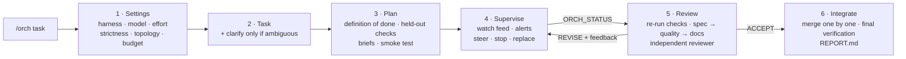

<div align="center">

# /orch

**Turn Claude Code into a supervising tech lead for headless coding agents.**

Claude plans the work, launches Claude Code, Codex, Gemini CLI, opencode, Cursor, Qwen, Antigravity,
Hermes and others **headless**, watches every tool call live, corrects them mid-run, **re-runs the
tests itself**, reviews the diff and the agents' running documentation, and sends feedback until the
result meets the quality bar you chose.

`one command` · `16 harnesses` · `live steering` · `test-based acceptance` · `stdlib-only Python`

</div>

---

## Install

**Paste this into Claude Code:**

```text
Install the /orch skill: run `curl -fsSL https://raw.githubusercontent.com/legifx/orch/main/install.sh | bash`,
then show me the `orch detect` output and tell me which harnesses are ready to orchestrate.
```

Or run it yourself:

```bash
curl -fsSL https://raw.githubusercontent.com/legifx/orch/main/install.sh | bash
# = git clone https://github.com/legifx/orch ~/.claude/skills/orch  +  ln -s …/bin/orch ~/.local/bin/orch
```

Requirements: Claude Code, `git`, Python ≥ 3.9 (no packages), and at least one harness CLI that is
logged in (Claude Code itself counts). Tested on Linux; macOS should work (POSIX process groups).
Windows only via WSL.

Start a new Claude Code session in your project and type:

```text
/orch add rate limiting to the public API
```

---

## What happens when you type `/orch`



### Step 1 — Settings ("grill me")

`orch detect` runs the moment the skill loads, so Claude already knows what is installed and
logged in:

```text
INSTALLED HARNESSES (4):
  claude        2.1.283 (Claude Code)        auth ok     steer=hook    effort=low/medium/high/xhigh/max
                models: aliases: fable, opus, sonnet, haiku (or a full model id)
  agy           1.2.12                       auth ?      steer=restart effort=low/medium/high
                models: `agy models` (e.g. gemini-3.8-flash-high, gemini-3.1-pro-high, …)
  hermes        Hermes Agent v0.21.2         auth ?      steer=restart effort=none/minimal/low/medium/high/xhigh
  command-code  1.53.0                       auth ?      steer=restart effort=low/medium/high
NOT INSTALLED: codex, gemini, opencode, cursor, qwen, copilot, amp, droid, goose, crush, kiro, aider
LOCAL MODEL ENDPOINTS: none
```

Then Claude asks two quick multiple-choice rounds:

| Question | Options |
|---|---|
| **Harness** (multi-select) | every installed CLI, the best authenticated one recommended |
| **Quality strictness** | `1 Draft` · `2 Standard` · `3 Strict` · `4 Paranoid` (see below) |
| **Topology** | single worker · parallel split (git worktrees) · best-of-N · decide after planning |
| **Budget** | ≤30 min · ≤2 h · ≤6 h · no limit |
| **Model / provider** per harness | strongest first; free text for any id or `provider/model` |
| **Effort** per harness | the levels that harness supports |

### Step 2 — The task

Your prompt, taken from `/orch <task>` or asked for afterwards. Claude asks follow-up questions
only if the answer would change the result. At strictness ≥3 it always confirms the definition of done.

### Step 3 — Plan and pipeline check

Claude scans the repository and records the **baseline** (which tests already fail). It then writes
`.orch/runs/<run>/PLAN.md`:

- a **definition of done** where every item is a command with an expected result
- **held-out checks**: edge cases Claude runs at review time and never shows a worker, so a worker
  can't special-case them
- the **work split**: scope globs, protected (read-only) paths, dependencies
- a **task ledger** and a **progress ledger** (Magentic-One style)

Each worker gets a self-contained **brief**, and every harness/model pair gets an `orch smoke` test
(exit code, event parsing, session id) *before* any real work starts.

### Step 4 — Looking over their shoulder

Workers run **detached**, so they keep working even if you close the Claude Code session. `orch watch`
blocks until something happens and then returns a condensed feed plus alerts:

```text
RUN 20260927-132356-fix-calc  strictness 3 (strict)  13:24:12
  impl           running  r1      15s    18 ev  worklog 15s           -  claude/haiku

── impl (10 new) ──
  r1 » Now let me read the test file to understand what functions are needed:
  r1 $ python3 -m unittest discover -s tests -t .
  r1   └ exit 1: Traceback (most recent call last): …
  r1 ✎ tests/__init__.py
  r1   └ exit 1: PreToolUse:Write hook error: [ORCHESTRATOR GUARD] tests/__init__.py is protected (read-only for workers) …
!! impl: SCOPE - edit outside assigned scope: tests/__init__.py
```

| Alert | Fires when |
|---|---|
| `DANGER` | push, force, `reset --hard`, `rm -rf`, `sudo`, `curl \| sh`, publish, … |
| `SCOPE` | an edit outside the worker's assigned globs |
| `CHEAT?` | `.skip(`, `@ts-ignore`, `\|\| true`, `assert True`, lint-disables, stubs written into code |
| `TEST_EDIT` | an *existing* test file was modified (new tests are fine) |
| `LOOP` | the same command repeated with no edit in between |
| `FAIL_STREAK` · `CHURN` · `IDLE` | failing commands in a row · same file edited ≥8× · no events for minutes |
| `STALE_DOC` | code is changing but the worklog isn't |
| `WORKER_BLOCKED` · `NEEDS_CONTEXT` · `PLAN_READY` · `NO_STATUS` | the worker's own status line (or its absence) |

Claude answers with the **smallest effective intervention**:

```text
orch steer impl "STOP editing tests — the assertion is right; the bug is in calc.py:2 (a - b). Fix the source."
```

| Channel | Harnesses | Latency | How |
|---|---|---|---|
| **hook** | Claude Code | the next tool call | PostToolUse hook injects the message; the Stop hook blocks "finishing" until the worker has read it |
| **soft** | all others | the next step | `.orch/INBOX-<worker>.md`, which the contract tells the worker to re-read |
| **hard** | all with sessions | immediate | SIGINT, then resume the same session with the correction |

For Claude Code workers the same hooks also act as **guards**. Writes to protected paths (for example
your existing tests) and reads of the orchestrator's private files are **denied before they run**,
not merely reported.

### Step 5 — Review

When a worker finishes, Claude does **not** read the worker's summary and nod. In order:

1. **Status gate**: `DONE`, `DONE_WITH_CONCERNS`, `NEEDS_CONTEXT`, `BLOCKED` or `PLAN_READY`.
2. **Reproduce**: every definition-of-done command, *exactly as written*, plus the full suite, build
   and lint, compared against the baseline.
3. **Held-out checks** the worker never saw.
4. **Spec compliance** per item (PASS/FAIL with evidence). Quality review waits until the spec passes.
5. **Quality**: correctness, edge cases, security, simplicity, fit with codebase conventions, test quality.
6. **Independent reviewer** (strictness ≥3): a fresh-context subagent. Strictness 4 adds a reviewer
   from a **different model family** that runs read-only through `orch start --read-only`.
7. **Documentation**: the worklog must match the diff, and its *Verification* section must reproduce.
   README and docs must be updated. Claude **fixes small doc errors itself** and sends big gaps back.
8. **Verdict**: `ACCEPT` · `REVISE` (numbered, evidence-backed feedback via `orch resume`) · `REPLACE`
   (a fresh worker or a stronger model) · `ESCALATE` (to you).

> **Real example from testing.** A worker wrote *"✓ All unit tests passing"* in its worklog. Claude
> re-ran the exact acceptance command from the brief, `python3 -m unittest discover -s tests -t .`, and it
> **failed**: the worker had verified with a different command that happened to pass. That is the
> failure mode this review step exists to catch.

### Step 6 — Integrate and report

Parallel and best-of-N workers live on their own branches in git worktrees. Accepted branches are
merged **one at a time**, with a full re-test after each merge. You get a `REPORT.md` and a summary:
each definition-of-done item ✅/❌ with its evidence, rounds, interventions, cost, and open issues.
Claude doesn't commit or push unless you ask.

---

## A real run, end to end

This is an actual test run. The orchestrator is Claude Sonnet running `/orch`; the worker is Claude Haiku
(effort low); strictness is 3. All artifacts are in
[`examples/slugkit-strict-run/`](examples/slugkit-strict-run/).

```text
/orch slugify() must transliterate accented Latin characters ("Crème Brûlée" -> "creme-brulee",
      "Straße" -> "strasse") and gain max_length that truncates at a word boundary; expose --max-length N.
```

| ≈ min | Orchestrator | Worker |
|---|---|---|
| 0:00 | Scans the repo, records the baseline (2/2 tests green), `orch init -s 3` | |
| 0:02 | Writes [PLAN.md](examples/slugkit-strict-run/PLAN.md): 7 definition-of-done items, 7 **held-out** edge cases; writes the [brief](examples/slugkit-strict-run/brief-w1.md); `orch smoke claude -m haiku` ✅ | |
| 0:03 | `orch start w1 --protect-existing-tests --scope 'slugkit/**,…'` | starts: NFKD transliteration, `max_length` |
| 0:04 | `watch` shows the guard blocking an edit to the protected test file. The protection was too broad (the brief asked for tests to be added there), so the orchestrator widens it live and steers: *"you may now ADD tests; don't touch the 2 existing assertions"* | adapts after its next tool call |
| 0:07 | | `ORCH_STATUS: DONE`: "all tests pass" |
| 0:08 | **Review round 1.** Every definition-of-done command passes *as written*, but the held-out checks fail: `slugify("Ã")` → `"ss"` (the worker had hard-coded `replace("Ã","ss")`), and `slugify("ab cd ef", max_length=5)` → `"ab"` instead of `"ab-cd"`. A fresh-context **reviewer subagent** confirms both and adds a third: negative `max_length` silently eats characters | |
| 0:09 | Verdict **REVISE**. [Feedback](examples/slugkit-strict-run/feedback-r1.md): 3 blocking items with the failing input, the expected output and the root cause | round 2: fixes all three and adds regression tests |
| 0:11 | **Review round 2.** Re-runs everything itself: 10/10 tests pass, the 2 original tests are untouched, all 7 held-out checks pass. The [worklog](examples/slugkit-strict-run/WORKLOG-w1.md) documents the tests but skipped the README, so the orchestrator **adds the README note itself** | |
| 0:12 | **ACCEPT**. Writes the [REPORT.md](examples/slugkit-strict-run/REPORT.md): definition of done 7/7 ✅ with evidence, open issues (æ/ø/ł are out of scope), not committed | |

Cost: worker $0.78 + orchestrator $1.22. The worker's own "done" hid **two high-severity bugs** that
the literal acceptance commands didn't catch. The held-out checks and the independent reviewer did.

---

## Strictness

One setting controls both how closely Claude watches and how hard it judges.

| | **1 Draft** | **2 Standard** | **3 Strict** | **4 Paranoid** |
|---|---|---|---|---|
| Watch interval | 180 s | 120 s | 75 s | 45 s |
| Intervenes on | danger | + loops, fail streaks, scope, cheating | + test edits, stale docs, drift | any doubt |
| Plan gate before coding | – | – | for non-trivial tasks | always |
| Existing tests | writable | writable (edits flagged) | **read-only** (`--protect-existing-tests`) | read-only |
| Acceptance | happy path runs | every definition-of-done item reproduced, suite green | + held-out checks, no findings ≥ medium | + adversarial probes, zero findings |
| Independent review | – | – | fresh-context subagent | + cross-model reviewer |
| Worklog | exists | complete (enforced by the Stop hook) | accurate and kept current | Verification must reproduce exactly |
| Max feedback rounds | 1 | 2 | 3 | 5 |

---

## The worker contract

Every worker gets [`templates/worker-contract.md`](templates/worker-contract.md) in front of its brief (as the
system prompt for Claude Code). Short version:

- stay inside your scope; never weaken, skip or special-case tests; no `git push`, force, deploys or sudo
- verify with **exactly** the commands in your brief; after 3 failed attempts at the same problem, report BLOCKED
- nobody can answer mid-turn: assume, record it under *Decisions*, carry on
- keep `.orch/WORKLOG-<name>.md` current **while working**: `Status · Done · Decisions · Verification · Open issues · Handoff`
- update the user-facing docs your change affects
- end with `ORCH_STATUS: DONE | DONE_WITH_CONCERNS | NEEDS_CONTEXT | BLOCKED | PLAN_READY`

---

## Supported harnesses

| Harness | Live feed | Steering | Resume | Verified with `orch smoke` |
|---|---|---|---|---|
| Claude Code | ✅ stream-json | **hook** (+ guards) | ✅ | ✅ |
| Google Antigravity (`agy`) | ✅ | soft / hard | ✅ | ✅ |
| Hermes Agent (Nous) | diff pulse | soft / hard | ✅ | ✅ |
| Command Code | ✅ | soft / hard | ✅ | ✅ |
| OpenAI Codex CLI | ✅ | soft / hard | ✅ | from docs |
| Gemini CLI | ✅ | soft / hard | ✅ | from docs |
| Qwen Code | ✅ | soft / hard | ✅ | from docs |
| opencode | ✅ | soft / hard | ✅ | from docs |
| Cursor CLI | ✅ | soft / hard | ✅ | from docs |
| GitHub Copilot CLI | partly | soft / hard | ✅ | from docs |
| Amp | ✅ | soft / hard | ✅ | from docs |
| Factory Droid | diff pulse | soft / hard | ✅ | from docs |
| Goose | ✅ | soft / hard | ✅ | from docs |
| Kiro CLI | ✅ | soft / hard | ✅ | from docs |
| Crush | diff pulse | soft | – | from docs |
| Aider | diff pulse | soft / hard | history | from docs |

Exact flags and quirks: [`references/harnesses.md`](references/harnesses.md). If `orch smoke` fails for a
harness "from docs", please open an issue with the output. Adding a harness takes about 30 lines:
`build()` plus `parse()`.

---

## The `orch` CLI

The skill drives a small stdlib-only Python CLI. You can use it directly too:

```text
orch detect [--json]                         installed harnesses, versions, auth, steering channel
orch smoke HARNESS [-m M] [-e E]             one cheap headless call: exit, events, session id
orch init SLUG -s 1..4 [-H h -m m -e e]      new run under .orch/ (git-excluded), PLAN.md template
orch start NAME --task-file F [-H -m -e] [--worktree] [--scope GLOBS] [--protect GLOBS]
           [--protect-existing-tests] [--read-only] [--max-minutes N] [--skills a,b]
orch watch [--timeout S] [--workers a,b]     block until activity / alert / finish → condensed feed
orch wait [--workers a,b] [--all] [--timeout S]   block until a worker (or all) stops; no activity wake-ups
orch steer NAME "msg" [--mode hook|soft|hard]
orch resume NAME "msg" | --message-file F    next round on the same session (feedback)
orch status | log NAME [--full] | diff NAME [--stat] | doc NAME
orch update NAME [--scope G] [--add-protect G] [--unprotect G]   live scope/protection change
orch stop NAME|all | merge NAME | clean [--branches]   (clean keeps run logs and copies worklogs out first)
```

```text
your-project/
└── .orch/                                  ← git-excluded automatically
    ├── current
    ├── runs/<run>/
    │   ├── run.json · PLAN.md · REPORT.md
    │   ├── tasks/<worker>.md               ← briefs
    │   └── workers/<worker>/
    │       ├── worker.json                 ← harness, model, session id, round, cost
    │       ├── prompt.rN.md · events.rN.jsonl · stderr.rN.log
    │       └── inbox.md · watch.json
    ├── wt/<run>-<worker>/                  ← git worktrees (parallel / best-of-N)
    └── WORKLOG-<worker>.md                 ← the worker's running documentation
```

---

## Why it is built this way

The design comes from a survey of current orchestration systems and research (September 2026):

| Finding | Source | What /orch does |
|---|---|---|
| Models can't reliably correct their own reasoning without outside feedback; execution feedback does work | Huang et al., ICLR'24; Anthropic harness-design | Acceptance comes from **running** checks, never from the worker's claims |
| Judges favour their own model family | arXiv 2410.21819, EMNLP'25 | Strict and paranoid runs use a fresh-context reviewer, then a **cross-family** one |
| Frontier agents game impossible tests (up to 76% in ImpossibleBench); access controls work, prompt warnings don't | arXiv 2510.20270 | Existing tests are **hook-protected**, and held-out checks stay private |
| Spec problems are the biggest failure class in multi-agent systems (MAST: 41.8%) | arXiv 2503.13657 | A definition of done with commands, a plan gate, self-contained briefs |
| Independent agents amplify errors 17×; a central coordinator cuts that to 4× | arXiv 2512.08296 | One orchestrator, single worker by default, parallel only when files are disjoint |
| Share context or keep writes single-threaded | Cognition, "Don't build multi-agents" | Disjoint scopes, one worktree per worker, serialized merge |
| Task and progress ledgers with stall detection | Magentic-One | `PLAN.md` ledgers; LOOP, IDLE and CHURN alerts trigger a replan |
| Two-stage review: spec first, then quality; a worker status enum | obra/superpowers | Review order and the `ORCH_STATUS` protocol |
| A progress file plus git as the handoff between sessions | Anthropic, long-running harnesses | The mandatory worklog, audited by Claude |
| Feedback friction: models resist corrections | arXiv 2506.11930 | Evidence-backed feedback with a "Do not" list; replace a worker after 2 stuck rounds |
| Multi-agent costs about 15× the tokens | Anthropic multi-agent research | Single worker is recommended; strong orchestrator + fast worker; budgets per worker |

Also studied: OpenAI Agents SDK (agents-as-tools vs handoffs), LangGraph (checkpointed state), CrewAI
Flows, Microsoft Agent Framework, Google ADK LoopAgent, MetaGPT/ChatDev SOPs, OpenHands, claude-squad,
Conductor, vibe-kanban, Gas Town (Witness role, Refinery merge queue), the Ralph loop, Spec Kit/Kiro,
and AGENTS.md.

---

## FAQ

**Does it work without git?** Workers run, but you get no diffs, worktrees or rollback. `orch init` warns you; run `git init` first.

**What does it cost?** The orchestrator's tokens plus the workers'. `orch status` shows per-worker
cost where the harness reports it. A cheap, fast worker under a strong orchestrator is usually the
best trade.

**Are workers sandboxed?** They run with auto-approve inside your project so they can work
unattended. The contract forbids destructive actions, `DANGER` alerts catch them, and Claude workers
are hook-guarded. For untrusted tasks, run inside a container or VM, or use the harness's own sandbox
(Codex runs `workspace-write` by default).

**Can I close Claude Code while workers run?** Yes, workers are detached. Reopen the session, run
`/orch` or `orch status`, and carry on. All state is in `.orch/`.

**Can Claude just write the code itself when a worker is slow?** It's told not to. The orchestrator
stays the judge. Separating generator and evaluator is where the quality gain comes from.

## License

MIT
